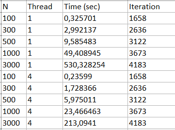

# Библиотека OpenMP
Давайте рассмотрим книгу В. П. Гергеля “Высокопроизводительные вычисления для многоядерных многопроцессорных систем” (2010). В главе 11 "Решение дифференциальных уравнений в частных производных", описывающей проблему численного решения задачи Дирихле для уравнения Пуассона, содержится алгоритм 11.6 (Блочный подход к методу волновой обработки данных) её решения, который может быть эффективно распараллелен при помощи OpenMP.

В первой части задания вам следует просто разобраться в этом алгоритме и реализовать его. Обратите внимание, что он возникает итерационно. Например, алгоритм 11.2 является корректным, но распараллеливание приводит к замедлению в 25 раз вместо ускорения.

Вторая часть задания — провести численный эксперимент, исследующий эффективность (или неэффективность) параллельной версии. Модельные краевые задачи необходимо выбрать самостоятельно, исходя из того, что вы хотели бы теми или иными экспериментами продемонстрировать. Это наиболее сложная часть задания

# Эксперимент
Эксперbмент проводился с нескольким числом сеток с разными размерами:

$N$ = [100, 300, 500, 1000, 3000]

Также сравнивались изменения зависящие от числа потоков:

$Threads$ = [1, 4]

В результате для 

$u(x,y) = 1000 \cdot x^3 \cdot y - 2000 \cdot y^4 + 500 \cdot y^3 + x^2 \cdot y^3 - 700 \cdot x + 250 \cdot y$

$f(x,y) = 6000 \cdot x \cdot y + 2 \cdot y^3 + 6 \cdot x^2 \cdot y - 24000 \cdot y^2 + 3000 \cdot y$

Были получены следующие результаты: 

