# Библиотека OpenMP
Давайте рассмотрим книгу В. П. Гергеля “Высокопроизводительные вычисления для многоядерных многопроцессорных систем” (2010). В главе 11 "Решение дифференциальных уравнений в частных производных", описывающей проблему численного решения задачи Дирихле для уравнения Пуассона, содержится алгоритм 11.6 (Блочный подход к методу волновой обработки данных) её решения, который может быть эффективно распараллелен при помощи OpenMP.

В первой части задания вам следует просто разобраться в этом алгоритме и реализовать его. Обратите внимание, что он возникает итерационно. Например, алгоритм 11.2 является корректным, но распараллеливание приводит к замедлению в 25 раз вместо ускорения.

Вторая часть задания — провести численный эксперимент, исследующий эффективность (или неэффективность) параллельной версии. Модельные краевые задачи необходимо выбрать самостоятельно, исходя из того, что вы хотели бы теми или иными экспериментами продемонстрировать. Это наиболее сложная часть задания

# Эксперимент

Проведем численный эксперимент, исследующий эффективность (или неэффективность) распараллеливания.

Опираясь на рассмотренную книгу, и приведенные в ней результаты, были выдвинуты следующие предположения:

1) При размере сетки 100 параллельный алгоритм замедлит время вычислений
2) Коэффициент ускорение будет увеличиваться с размером сетки в положительную сторону.

Вычислительная машина: ОС Ubuntu 20.04.4, OpenMP версии 4.5, процессор 11th Gen Intel(R) Core(TM) i3-1115G4 @ 3.00GHz, максимальное число потоков: 4.

Расчет теоретического ускорения будет производится следующим образом:

$`t(process\_block) \approx Block\_size^2 * C, \ C \in R`$ 

$`t_1(process) = iter * (t(process\_block) * Block\_num^2 + C_1 * Block\_num), \ C_1 \in R`$

$`t_n(process) = iter * (\displaystyle\sum_{i = 1}^{Block\_num}
t(process\_block) * ceil(i/n) +
\displaystyle\sum_{i = 1}^{Block\_num - 1} t(process\_block) * 
ceil(i/n) + C_1 * Block\_num) = `$  
$`= iter * (2 * t(process\_block) * \displaystyle\sum_{i = 1}^{Block\_num - 1} ceil(i/n) +
t(process\_block) * ceil(Block\_num/n) + C_1 * Block\_num), \ C_1 \in R`$

где 

$N$ - размер сетки

$`Block\_size`$ - размер блока

$t(x)$ - время выполнения

$t_n(x)$ - время выполнения на $n$ потоках

$iter$ - количество итераций внешнего цикла

$ceil(x)$ - округление $x$ в большую сторону

$`Block\_num = ceil((N+2) / Block\_size)`$ - количество блоков

(Все расчеты находятся в Result/expected_acceleration)

Также стоит учитывать что реальное ускорение меньше максимального, поэтому полученное ускорение стоит домножить на 0,75 (примерно такое соотношение можно получить опираясь на результаты из книги)

В итоге получим такие значения:

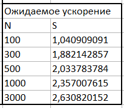

Доверительный интервал (уровень доверия 95%) расчитывается по формуле

$di = sr +- \delta
$ 

где

$sr$ - среднее значение без выбросов

$\delta$ - погрешность

Погрешность расчитывается по формуле

$\delta = a \cdot d / \sqrt n$

где 

$a$ - уровень доверия

$d$ - дисперсия

$n$ - число экспериментов

Для того, чтобы устранить выбросы был использован критерий Граббса для исключения грубых погрешностей.
Изначально находится мат ожидание $m$ для необходимых значений.
Затем вычисляется среднее квадратичное отклонение по следующей формуле

$\sigma = \sum \frac{(x_i-m)^2}{n - 1}$

где $x_1,x_2,...,x_n$ - необходимое значение каждого эксперемента.

Тогда при уровне доверия 95% значение будет считаться выбросом если:

$\frac {x_i - m} {\sigma} > 2,176$

Эксперимент проводился с нескольким числом сеток с разными размерами:

$N$ = [100, 300, 500, 1000, 3000]

Также сравнивались изменения зависящие от числа потоков:

$Threads$ = [1, 4]

Проведем вычисления для 

$u(x,y) = 10 \cdot x^3 + 20 \cdot y^3 $

$f(x,y) = 60 \cdot x + 120 \cdot y^2 $

Результат вычислений:

Было проведено 10 запусков и получены следующие средние значения без выбросов

Результат каждого из них можно увидеть в Result/res_f2

(Дальше для каждого значения также было проведено по 10 запусков и брались средние значения без выбросов)

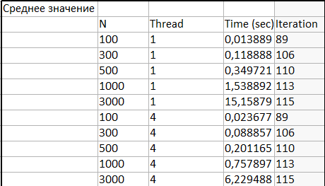
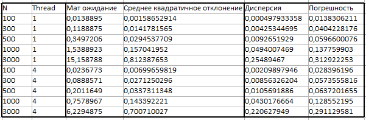

По ним можно увидеть что если сетка имеет размер 100, то на 1 потоке вычисления происходят быстрее, чем на 4 почти в 2 раза. В остальных случаях с каждым увеличение размера сетки увеличивается и ускорение работы на 4 потоках.

Ниже представлено соотношение времени исполнения на 4 потоках ко времени на 1 потоке.

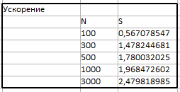
    
    Попробуем увеличить значение степени и отследить, на что это повлияет

1)  $u(x,y) = 10 \cdot x^4 + 20 \cdot y^4 $

    $f(x,y) = 120 \cdot x + 240 \cdot y^2 $

2)  $u(x,y) = 10 \cdot x^5 + 20 \cdot y^5 $

    $f(x,y) = 200 \cdot x^3 + 400 \cdot y^3 $

3)  $u(x,y) = 10 \cdot x^{50} + 20 \cdot y^{50} $

    $f(x,y) = 24500 \cdot x^{48} + 49000 \cdot y^{48} $

Первое увеличение степени дало следующий результат:

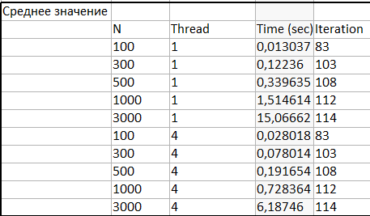
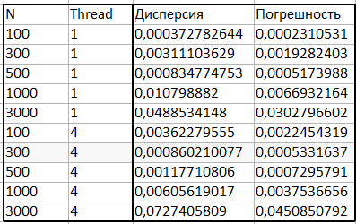

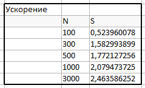

(Результаты в Result/res_f5)

Можно увидеть, что используя 4 потока ускорение практически не изменилось.

Второе увеличение степени:

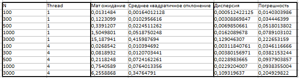

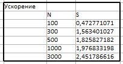

(Результаты в Result/res_f6)

Значения практически не изменились.

Третье увеличение степени:

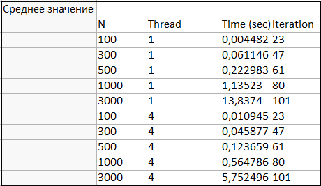
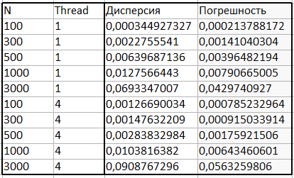

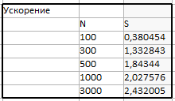

(Результаты в Result/res_f7)

В этот раз мы увеличили значение степеней в 10 раз (по сравнению с предыдущим). Можно заметить что ускорение используя 4 потока стало работать еще хуже (медленее) на сетки размером 100, но помимо этого еще и ухудшилось ускорение с сеткой 300 на 300 (по сравнению с предыдущими результатами). Из этого можно сделать вывод, что чем больше значение степеней, тем сильнее будет замедляться ускорение на 4 потоках при условии, что размер сетки не изменяется. 

    Попробуем увеличить значение констант и отследить, на что это повлияет.

1)  $u(x,y) = 100 \cdot x^3 + 200 \cdot y^3 $

    $f(x,y) = 600 \cdot x + 1200 \cdot y $

1)  $u(x,y) = 1000 \cdot x^3 + 2000 \cdot y^3 $

    $f(x,y) = 6000 \cdot x + 12000 \cdot y $

Первое увеличение констант дало следующий результат: 

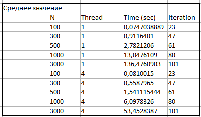
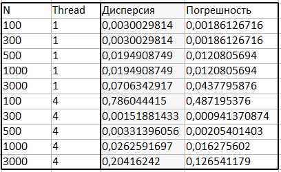

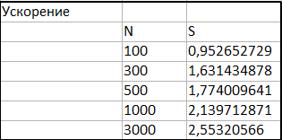

(Результаты в Result/res_f3)

В этот раз 4 поточное ускорение на сетке 100 также замедляет вычисления, но уже не так критично, даже практически не значительно. В остальных случаях ускорение на 4 потоках сделало то, что от него и ожидалось (ускорило).

Второе увеличение констант:

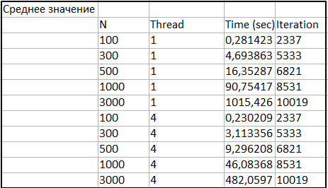

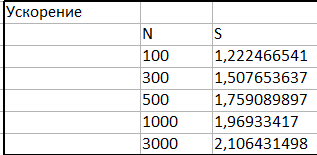

(Результаты в Result/res_f4)

Теперь видно, что во всех случаях ускорение с 4 потоками отрабатывает как и требовалось и не замедляет вычисления.

Можно также заметить что количество итераций, а с этим и время выполнения сильно увеличивается с увеличением константы, а с изменением значений степени наоборот уменьшаеется.

Тем не менее ожидается что если взять случайную функцию, то ускорение даст положительный результат(ускорит).

Выберем функцию случайным образом, которая будет включать в себя различные степени и константы.

$u(x,y) = 1000 \cdot x^3 \cdot y - 2000 \cdot y^4 + 500 \cdot y^3 + x^2 \cdot y^3 - 700 \cdot x + 250 \cdot y$

$f(x,y) = 6000 \cdot x \cdot y + 2 \cdot y^3 + 6 \cdot x^2 \cdot y - 24000 \cdot y^2 + 3000 \cdot y$

Были получены следующие результаты: 

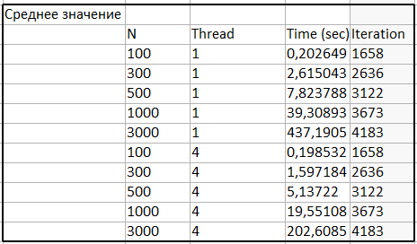
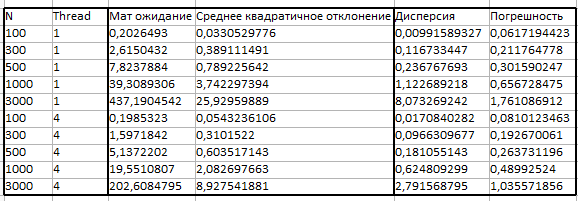

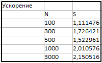

(Результаты в Result/res_f1)

В этом случае ускорение также не вызвало замедения.

После проведенных эксперементов можно сделать следующие выводы:
1) При размере сетки 100 параллельный алгоритм не всегда замедляет время вычислений, но в большинстве случаев это так. Исключением была лишь 2 функция для которой увеличивали значение констант. Это говорит о том, что чем больше константа, тем выше вероятность того, что параллельный алгоритм ускорит время вычислений.

2) Коэффициент ускорение увеличивается с размером сетки в положительную сторону.

3) Практическое ускорение не всегда совпадает с теоретическим. Тем не менее оно приближается к нему и в основном находится достаточно близко, поэтому с учетом погрешностей это можно нивелировать. Исключением является параллельный 4 поточный алгоритм работающий на сетке размером 100, в основном сильно замедляющий вычисления. Это предположительно вызвано неточной оценкой ожидаемого ускорения.
